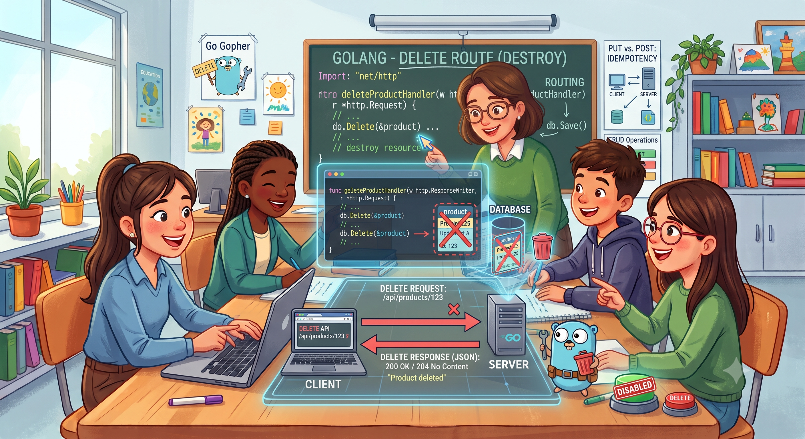

# 🚀 Roteamento Essencial: Entendendo o Método PUT

O domínio das rotas `GET`, `POST`, `PUT` e `DELETE` (CRUD) é a base de qualquer aplicação web. Esta sequência de *branches* foi estruturada para ensinar o básico de cada método, seguindo o princípio de **dividir para conquistar**.

## 1. Instalar as Dependências

Execute os comandos abaixo no terminal para inicializar o módulo e instalar os pacotes necessários:

```bash
go mod init meu-projeto-chi
go get -u github.com/go-chi/chi/v5
go get -u gorm.io/gorm
go get -u gorm.io/driver/postgres
``` 

---

## 🎯 Branch Atual: `Topic/API_CRUD_DELETE_I`

## 🗑️ As Duas Formas de Deletar Dados 

1. Hard Delete (Exclusão Física).

&nbsp;&nbsp;&nbsp;&nbsp;É o DELETE clássico do SQL (DELETE FROM usuarios WHERE id = ...). O registro é completamente apagado do disco do banco de dados.

- Pró: Limpa espaço em disco instantaneamente.
- Contra: Se foi apagado por engano (ou por um ataque), já era. Não dá para recuperar sem um backup.

2. Soft Delete (Exclusão Lógica)

&nbsp;&nbsp;&nbsp;&nbsp;O registro não é apagado do banco de dados. Em vez disso, adicionamos uma coluna chamada deletado_em (ou deleted_at) na tabela. Quando o usuário pede para deletar, o Go apenas grava a data/hora atual nessa coluna. Nas consultas (GET), nós filtramos para trazer apenas onde deletado_em IS NULL.

#🏗️ A Estrutura de Pastas Completa

```bash
meu-projeto-chi/
├── cmd/
│   └── api/
│       └── main.go       # Conecta ao Postgres e injeta as dependências
├── internal/
│   ├── entity/
│   │   └── user.go       # Struct e validações de regras de negócio
│   ├── repository/
│   │   └── user_db.go    # Interface e execução do UPDATE no GORM
│   └── handler/
│       └── user_hand.go  # Validação do HTTP, extração do ID e chamada do repositório
```

# Go CRUD Completo com Chi, GORM e Clean Architecture

Este projeto é uma API REST robusta e performática desenvolvida em Go (Golang), utilizando o roteador leve `go-chi/v5` e o ORM `GORM` integrado a um banco de dados PostgreSQL. O objetivo principal deste repositório é demonstrar a transição de um código centralizado para uma arquitetura profissional desacoplada, aplicando os princípios do SOLID.

## 🏗️ Arquitetura e Princípios Aplicados

A estrutura do projeto foi dividida em camadas lógicas bem definidas, seguindo os padrões de **Clean Architecture**:

- **`internal/entity`**: Contém as regras de negócio e validações autônomas de dados (Princípio da Responsabilidade Única).
- **`internal/repository`**: Camada de persistência que dita os contratos de banco através de interfaces, isolando o ORM (Inversão de Dependência).
- **`internal/handler`**: Camada de entrega HTTP, responsável estritamente por gerenciar requisições, respostas, status codes e parâmetros de rotas.

---

## 🛠️ Tecnologias Utilizadas

- **Go** (Golang)
- **Go-Chi/v5** (Roteador HTTP idiomático)
- **GORM** (ORM para persistência)
- **PostgreSQL** (Banco de dados relacional com suporte nativo a UUID)

---


### Deletar Usuário (`DELETE`)
Executa a remoção física (*Hard Delete*) de um registro baseado em seu UUID.
- **URL:** `/usuarios/{id}`
- **Método:** `DELETE`
- **URL Params:** `id=[UUID Válido]`
- **Respostas:**
  - `204 No Content`: Usuário deletado com sucesso (sem corpo de resposta).
  - `400 Bad Request`: Se o formato do UUID enviado na URL for inválido.
  - `404 Not Found`: Se o usuário não for encontrado no banco de dados.

## Como testar.
&nbsp;&nbsp;&nbsp;&nbsp;Clone o repositṕorio e certifique-se de que o banco de dados existe. Rode o servidor //localhost.
entre no banco de dados e escolhe um id qualquer para testar o "delete" e em um terminal rode o comando 
```bash 
curl -X DELETE http://localhost:8080/usuarios/COLE-O-UUID-AQUI
```
