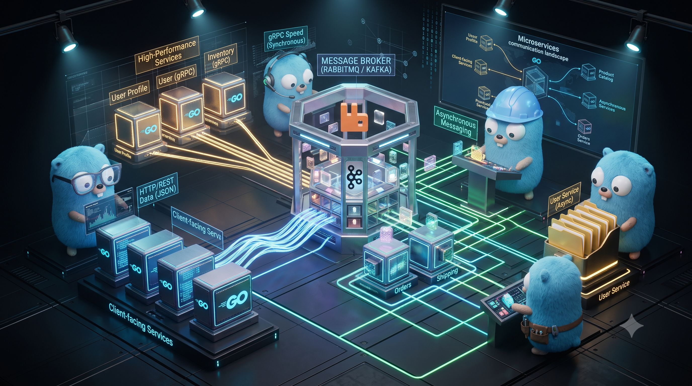

O gRPC é uma das tecnologias mais populares para comunicação síncrona interna, mas ele está longe de ser a única opção. Na verdade, a escolha da biblioteca ou do protocolo depende diretamente de como você quer que seus microserviços conversem.

Podemos dividir as alternativas ao gRPC em duas categorias principais: Síncronas (onde um serviço chama o outro e espera a resposta) e Assíncronas (onde as mensagens são disparadas sem esperar resposta imediata).

## 1. Alternativas para Comunicação Síncrona

Se você precisa de uma comunicação onde um serviço faz uma pergunta e precisa da resposta na hora para continuar:

## 🌐 HTTP/REST Tradicional (com JSON)

Sim, o bom e velho REST que você usou no seu CRUD com Chi também é amplamente utilizado para ligar microserviços!

- Como funciona: Um microserviço faz um disparo usando um cliente HTTP padrão do Go para outro microserviço que está rodando uma API REST.

- Vantagens: É extremamente simples de debugar, qualquer linguagem entende nativamente e não exige gerar código com compiladores como o protoc.

- Desvantagens: É muito mais lento que o gRPC e consome mais banda, pois o JSON é transmitido como texto puro (e não em formato binário compactado).

## 🕸️ GraphQL

Muito comum quando você tem um microserviço que serve como um "agregador" (frequentemente chamado de API Gateway ou de padrão BFF - Backend-For-Frontend).

- Como funciona: O cliente faz uma única requisição pedindo exatamente os campos que precisa, e o serviço GraphQL vai por baixo dos panos buscar esses dados em outros microserviços.

- Vantagens: Evita trafegar dados desnecessários na rede.

## 2. Alternativas para Comunicação Assíncrona (Event-Driven)

Se você quer que os microserviços sejam totalmente independentes, onde um não precisa saber se o outro está online para continuar funcionando, você usa Message Brokers ou plataformas de eventos:

## 🐇 RabbitMQ (O que vamos usar a seguir!)

Um Message Broker clássico focado em filas de mensagens.

- Como funciona: Um microserviço publica uma mensagem na fila, o RabbitMQ garante a entrega, e o outro microserviço consome quando puder.

- Ideal para: Garantir que processos pesados (como gerar um PDF, processar um pagamento ou enviar um e-mail) sejam executados em background sem travar o usuário.

## 🎡 Apache Kafka

Uma plataforma de streaming de eventos de altíssima performance.

- Como funciona: Em vez de filas simples que se apagam quando a mensagem é lida, o Kafka funciona como um "livro-razão" gigante e imutável onde os eventos ficam salvos.

- Ideal para: Sistemas gigantescos que precisam processar milhões de eventos por segundo em tempo real (como detecção de fraudes de cartão de crédito no Nubank ou rastreamento de motoristas na Uber).

## ☁️ NATS.io

Uma tecnologia de mensageria escrita totalmente em Go que é extremamente rápida, leve e muito querida na comunidade de Golang para arquiteturas de microserviços modernas e sistemas de nuvem.


## 💡 Resumo da Ópera

Não existe uma "única ferramenta bala de prata". Em arquiteturas reais de grandes empresas, é muito comum ver um sistema híbrido:

- O frontend se comunica com a API usando HTTP/REST ou GraphQL.

- Internamente, quando o Microserviço A precisa de uma resposta imediata do Microserviço B, eles conversam via gRPC.

- Para tarefas pesadas que podem rodar em background de forma assíncrona, eles usam RabbitMQ ou Kafka.

___

## O Projeto.

O gRPC pode parecer um pouco "mágico" no começo porque ele gera muito código por baixo dos panos, o que esconde o que realmente está acontecendo na rede.

Para clarear tudo de uma vez por todas, vamos criar o exemplo mais simples e clássico do mundo da programação: uma Calculadora gRPC (Serviço de Soma).

Desta vez, para evitar qualquer erro de importação ou confusão com pastas, vamos criar um único projeto Go que vai conter tanto o Servidor quanto o Cliente. Assim você consegue rodar e ver os dois lados no mesmo lugar!

Observe o diagrama abaixo para entender como a nossa chamada de soma vai trafegar pelo gRPC:

## 🏗️ Passo 1: Preparando a Pasta do Projeto

Crie uma pasta nova no seu computador chamada calculadora-grpc e inicialize o módulo do Go nela:
```bash
 mkdir calculadora-grpc
cd calculadora-grpc
go mod init calculadora-grpc
 ```

 ## 📄 Passo 2: O Contrato (calculadora.proto)
  - Crie o arquivo calculadora.proto
Ela vai definir o nosso serviço de matemática: Nós enviamos dois numeros inteiros(num1 e num2) e ele nos devolve o "resultado"   


___

# 📖 Explicação Detalhada Linha por Linha do arquivo calculadora.proto

### 🛠️ `syntax = "proto3";`
* **O que faz:** Avisa o compilador (`protoc`) que este arquivo usa a versão 3 do Protocol Buffers (a mais moderna e padrão para gRPC).
* **Por que importa:** Sem esta linha, o compilador assume por padrão que está a usar a versão antiga (`proto2`), que possui regras de sintaxe diferentes e mais complexas. Ela deve ser obrigatoriamente a primeira linha de código útil do arquivo.

---

### 📦 `package calculadora;`
* **O que faz:** Cria uma espécie de "pasta lógica" ou sobrenome para as mensagens e serviços deste arquivo.
* **Por que importa:** Se o seu projeto crescer e tiver outro arquivo `.proto` que também possua uma mensagem chamada `SomaRequest`, o gRPC não se vai confundir, pois um será `calculadora.SomaRequest` e o outro pertencerá a outro pacote.

---

### ⚙️ `option go_package = "./pb";`
* **O que faz:** Esta é uma configuração específica para quem programa em Go. Ela instrui o compilador do gRPC sobre a localização onde o código Go gerado (`.pb.go`) deve ser injetado.
* **Por que importa:** Neste caso, ele criará (ou usará) uma pasta chamada `pb` no mesmo diretório do arquivo `.proto` e colocará lá dentro todos os ficheiros Go estruturados com as funções prontas para importar no seu `main.go`.

---

### 🕸️ `service CalculadoraService { ... }`
* **O que faz:** Define a interface da API gRPC. É aqui que mapeia os endpoints (as rotas) da sua aplicação.
* **`rpc Somar (...) returns (...);`**: Ao contrário do REST, onde define caminhos de texto como `/usuarios`, no gRPC define chamadas de procedimento remoto (RPC). É como se o cliente chamasse uma função nativa no Go do servidor. Aqui, declara que a função se chama `Somar`, exige os dados do tipo `SomaRequest` e promete devolver um `SomaResponse`.

---

### 📥 `message SomaRequest { ... }` e `message SomaResponse { ... }`
* **O que faz:** As `message` são o equivalente direto às `structs` no Go. Elas moldam os dados que vão trafegar pela rede de forma compactada.
* **O mistério dos números `= 1;` e `= 2;`:** Isto **não são os valores** numéricos e não significa que o `num1` vale 1. Eles são tags numéricas de identificação (tags binárias).
* **Como funciona a mágica:** O gRPC não gasta largura de banda enviando o texto `"num1"` ou `"resultado"` pela rede (como o JSON faz). Ele converte tudo para binário e envia apenas: *"O dado que está na posição 1 vale tal valor"*. Isso faz com que a mensagem gRPC seja até 10 vezes menor e muito mais rápida de trafegar do que um JSON tradicional.


```bash 
syntax = "proto3";

package calculadora;

option go_package = "./pb";

// O contrato do serviço
service CalculadoraService {
  rpc Somar (SomaRequest) returns (SomaResponse);
}

// O que o cliente envia
message SomaRequest {
  int32 num1 = 1;
  int32 num2 = 2;
}

// O que o servidor responde
message SomaResponse {
  int32 resultado = 1;
}

``` 

## ⚡ Passo 3: Gerando as Estruturas em Go

Crie uma pasta chamada pb dentro de calculadora-grpc. Depois, rode o comando do protoc para traduzir o arquivo .proto para o Go:

```bash
mkdir pb
protoc --go_out=. --go-grpc_out=. calculadora.proto
```
Dica minha de inciante (Lucas Alves) pegue os arquivos gerados dentro da pasta ``` pb ``` e estude ela, pode pedir para uma i.a explicar para ver como os dados são trafegadose quao distantes isso fica de ```REST```

Em seguida instale as dependẽncias necessárias com os comandos abaixo.
- go get google.golang.org/grpc
- go mod tidy


## 💻 Passo 4: O Servidor (server.go)

Crie um arquivo chamado server.go na raiz do projeto. Ele vai conter a lógica que realmente faz a soma:


## 💻 Passo 5: O Cliente (client.go)

Crie outro arquivo chamado client.go na raiz do projeto. Ele vai conectar no servidor, enviar dois números e mostrar o resultado na tela:

