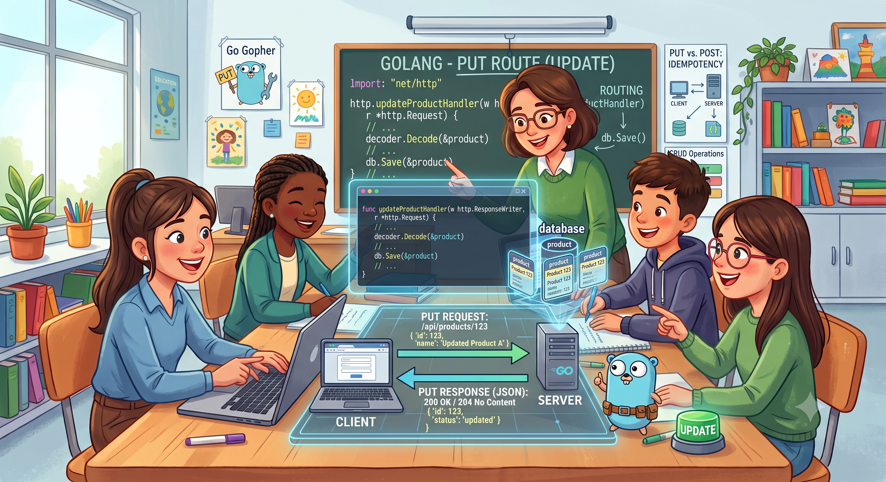

# 🚀 Roteamento Essencial: Entendendo o Método PUT

O domínio das rotas `GET`, `POST`, `PUT` e `DELETE` (CRUD) é a base de qualquer aplicação web. Esta sequência de *branches* foi estruturada para ensinar o básico de cada método, seguindo o princípio de **dividir para conquistar**.

## 1. Instalar as Dependências

Execute os comandos abaixo no terminal para inicializar o módulo e instalar os pacotes necessários:

```bash
go mod init meu-projeto-chi
go get -u github.com/go-chi/chi/v5
go get -u gorm.io/gorm
go get -u gorm.io/driver/postgres
``` 

---

## 🎯 Branch Atual: `Topic/API_CRUD_PUT_II`


&nbsp;&nbsp;&nbsp;&nbsp;Com esse método PUT robusto, você deu um salto gigante na maturidade como desenvolvedor. Você saiu do básico de "fazer funcionar" e entrou no nível de garantir a integridade dos dados e a estabilidade da aplicação em produção.


#🏗️ A Estrutura de Pastas Completa

```bash
meu-projeto-chi/
├── cmd/
│   └── api/
│       └── main.go       # Conecta ao Postgres e injeta as dependências
├── internal/
│   ├── entity/
│   │   └── user.go       # Struct e validações de regras de negócio
│   ├── repository/
│   │   └── user_db.go    # Interface e execução do UPDATE no GORM
│   └── handler/
│       └── user_hand.go  # Validação do HTTP, extração do ID e chamada do repositório
```


# Go CRUD com Chi e GORM

Este projeto é um laboratório prático para o desenvolvimento de uma API REST robusta utilizando Go (Golang), o roteador leve `go-chi` e o ORM `GORM` conectado a um banco de dados PostgreSQL.

## 🏗️ Arquitetura e Princípios Aplicados

O projeto foi estruturado seguindo os princípios da **Clean Architecture** e do **SOLID**, garantindo baixo acoplamento e alta testabilidade:

- **`internal/entity`**: Contém as regras de negócio puras (Structs) e validações autônomas de dados.
- **`internal/repository`**: Camada de persistência que dita os contratos de banco através de interfaces, isolando o ORM da lógica de transporte (Inversão de Dependência).
- **`internal/handler`**: Camada de entrega HTTP, responsável apenas por gerenciar requisições, respostas e parâmetros de rotas.

---

## 🛠️ Tecnologias Utilizadas

- **Go** (Golang)
- **Go-Chi/v5** (Roteador HTTP)
- **GORM** (ORM para persistência)
- **PostgreSQL** (Banco de dados relacional com suporte a UUID)

---

## 🚀 Endpoints Disponíveis

### Atualizar Usuário (`PUT`)

Substitui os dados de um usuário existente com validação estrita de campos obrigatórios.

- **URL:** `/usuarios/{id}`
- **Método:** `PUT`
- **Headers:** `Content-Type: application/json`
- **URL Params:** `id=[UUID Válido]`

#### Corpo da Requisição (Request Body):
```json
{
  "nome": "Lucas Alves Atualizado",
  "email": "lucas.novo@gmail.com",
  "sexo": "Masc"
}
``` 
___   

🧠 O que aprendemos com este método PUT?   

## 1. Defesa em Camadas (Fail-Fast)   

&nbsp;&nbsp;&nbsp;&nbsp; Aprendemos que uma API Plena não confia no que o cliente envia. Ao colocar o método Validar() na nossa entidade, aplicamos o conceito de Fail-Fast (Falhe Rápido). Se o JSON vier incompleto, a requisição é rejeitada no Handler imediatamente, poupando processamento e conexões com o banco de dados.

## 2. Idempotência e Substituição Semântica

&nbsp;&nbsp;&nbsp;&nbsp; O PUT serve para substituir um recurso. Aprendemos que, se o cliente não enviar um dos campos exigidos, a aplicação deve retornar um erro (400 Bad Request) em vez de simplesmente aceitar o valor em branco e apagar/zerar a coluna no banco de dados por acidente.
## 3. Preservação de Estado Imutável

&nbsp;&nbsp;&nbsp;&nbsp;Ao buscar o usuário no banco antes (FindByID), atualizar apenas os campos mutáveis (Nome, Email, Sexo) e depois salvar, aprendemos como preservar informações que o cliente não deve alterar via PUT, como o ID (UUID) e a data de criação original (criado_em).
## 4. Lógica Booleana Reversa para Validações

&nbsp;&nbsp;&nbsp;&nbsp;Consolidamos que, ao validar cenários de erro com negações (!=), precisamos usar o operador && (E) para que a condição só seja verdadeira se o dado enviado falhar em todas as opções aceitáveis ao mesmo tempo.

### Como testar
- Clone o repositório e instale as dependências    
  ```bash 
  go mod tidy 
  ```    
  - certifique-se de que o banco de dados existe, caso contrário executa o arquivo .yml com docker compose up -d
 - No terminal rode o servidor localhost
  ```bash 
    go run cmd/api/main.go 
 ``` 
 - Entre no docker exec -it xxxx bash, entre no banco de dados e pegue um id qualquer para testar  
 - Rode este comando no terminal substituindo o id após /usuarios/coloe-aqui-o-id. Dê um enter e verifica a resposta http no terminal que está rodando o servidor.
 - Verifica a tabela do banco com SELECT * FROM usuarios. Repare que o dados atualizado foi para o final da tabela, mas o id e data-hora continuam o mesmo.

## Resposta

- 200 OK: Usuário atualizado com sucesso retornando o JSON atualizado
- 400 badRequest: Se o UUID for inválido ou se algum campo obrigatório falhar na validação(ex: e-mail em branco, sexo inválido).
- 404 Not Found:Se o UUID não correspondera nenhum usuário no banco de dados.

