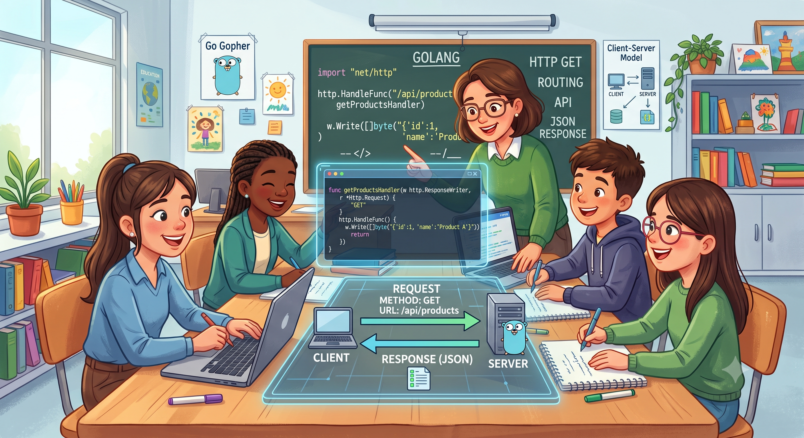

# 🚀 Roteamento Essencial: Entendendo o Método GET

O domínio das rotas `GET`, `POST`, `PUT` e `DELETE` (CRUD) é a base de qualquer aplicação web. Esta sequência de *branches* foi estruturada para ensinar o básico de cada método, seguindo o princípio de **dividir para conquistar**.

## 1. Instalar as Dependências

Execute os comandos abaixo no terminal para inicializar o módulo e instalar os pacotes necessários:

```bash
go mod init meu-projeto-chi
go get -u github.com/go-chi/chi/v5
go get -u gorm.io/gorm
go get -u gorm.io/driver/postgres
``` 

---

## 🎯 Branch actual: `Topic/API_CRUD_GET_II`

Nesta etapa, avançamos em direção à **Clean Architecture** e aos princípios **S.O.L.I.D.**

Em vez de quebrar a aplicação em dezenas de pastas logo no início (o que pode confundir), aplicamos o princípio da **Responsabilidade Única (S)** e a **Inversão de Dependência (D)** dentro do projeto. O código foi distribuído em camadas lógicas claras e isoladas.

Diferente da *branch* anterior (Topic/API_CRUD_GET_I), este código implementa uma separação estruturada de arquivos, abordando a **Injeção de Dependência** para evitar um código engessado e de difícil manutenção. O fluxo utiliza exclusivamente o método `GET` para buscar os dados do banco e disponibilizá-los no *front-end* via `localhost`.

### 🏗️ Estrutura de Pastas (Clean Architecture Simplificada)

```text
meu-projeto-chi/
├── cmd/
│   └── api/
│       └── main.go       # Inicialização do banco e do servidor web
├── internal/
│   ├── entity/
│   │   └── user.go       # Nossa Struct (Regras de Negócio/Espelho do Banco)
│   ├── repository/
│   │   └── user_db.go    # Camada de Dados (Comunicação com o Postgres via GORM)
│   └── handler/
│       └── user_hand.go  # Camada Web (Manipulação de requisições HTTP Chi)
├── go.mod
└── go.sum
``` 

---

## 🛠️ Prática e Aprendizados

Tire um tempo para estudar o código, executá-lo e fazer testes de integração. 

💡 **Dica importante:** Acesse o seu banco de dados, delete as tabelas usando o comando `DROP TABLE` e rode o projeto novamente com `go run cmd/api/main.go`. Note que as tabelas são reconstruídas de forma automática. Observe quem está construindo essas tabelas e como a modularidade facilita a identificação do papel de cada componente.

### Principais Conceitos Absorvidos:
1. **Consumo de Dados:** Aprendemos a usar o método `GET` para extrair informações do banco de dados PostgreSQL.
2. **Structs Espelho:** Compreendemos que no Go precisamos de uma estrutura que reflita exatamente os campos da tabela para mapear as informações corretamente.
3. **Conversão de Dados:** Vimos como o método `json.NewEncoder` traduz as nossas estruturas nativas e envia os dados formatados em JSON para o *front-end*.
4. **Facilidades do ORM:** Não utilizamos `json.NewDecoder` nesta fase porque o **GORM** faz todo o trabalho pesado de ler as linhas do banco e preencher a nossa *struct* espelho automaticamente.

---

## 💡 A Importância da Injeção de Dependência

Imagine que você vai tomar o seu café da manhã. Para comer um pão com manteiga, você precisa de uma **faca**. 

Se você fosse um programa de computador **sem** Injeção de Dependência, toda vez que quisesse comer um pão, seria obrigado a construir uma faca do zero: minerar o metal, forjar a lâmina, esculpir o cabo de madeira e, só então, cortar o pão.

Com **Injeção de Dependência**, você simplesmente avisa ao sistema: *"Eu preciso de uma faca"*. O mundo externo coloca a faca pronta na sua mão e você cumpre a sua tarefa.

Em termos de desenvolvimento, uma **Dependência** é qualquer ferramenta ou serviço que uma função precisa para trabalhar (como a conexão com o banco de dados). **Injetar** significa que essa ferramenta é passada pronta por parâmetro, evitando que a própria função tenha a responsabilidade de criá-la internamente.

### O Fluxo na Prática: Interfaces vs Structs

O segredo para entender esse fluxo de dados é mentalizar que a **Interface é um contrato** (uma folha de papel com regras) e a **Struct é o trabalhador real** que executa o que está escrito no contrato.

#### Passo 1: O Contrato (A Interface)
Criamos uma interface para ditar **o que** precisa ser feito, sem definir o comportamento físico. Ela reside no pacote `handler`, estabelecendo as regras que a camada web exige:

```go
package handler

import "://github.com"

// UserRepository define o contrato. 
// Qualquer componente que queira servir o Handler PRECISA implementar estes métodos.
type UserRepository interface {
	FindAll() ([]entity.PessoaResponse, error)
	FindById(id string) (*entity.PessoaResponse, error)
}
```

#### Passo 2: O Trabalhador Real (A Struct)
Criamos uma *struct* no pacote `repository` para assinar o contrato. Ela carrega a ferramenta física (`*gorm.DB`) e implementa as funções solicitadas:

```go
package repository

import (
	"://github.com"
	"gorm.io/gorm"
)

// UserRepositoryDB é o trabalhador real que manipula a ferramenta
type UserRepositoryDB struct {
	db *gorm.DB 
}

// NewRepositoryDB é a função construtora que recebe o banco de dados
func NewRepositoryDB(database *gorm.DB) *UserRepositoryDB {
	return &UserRepositoryDB{db: database}
}

// Implementação dos métodos do contrato utilizando o GORM
func (r *UserRepositoryDB) FindAll() ([]entity.PessoaResponse, error) {
	var lista []entity.PessoaResponse
	err := r.db.Find(&lista).Error
	return lista, err
}

func (r *UserRepositoryDB) FindById(id string) (*entity.PessoaResponse, error) {
	var usuario entity.PessoaResponse
	err := r.db.First(&usuario, "id = ?", id).Error
	return &usuario, err
}
```

#### Passo 3: O Dono da Obra (O Handler)
O seu `Handler` precisa do trabalhador, mas ele só se comunica através das regras do contrato (Interface). Ele não quer saber detalhes se o banco é Postgres ou MySQL:

```go
package handler

import (
	"encoding/json"
	"net/http"
)

// UserHandler depende exclusivamente do contrato
type UserHandler struct {
	repo UserRepository 
}

func NewUserHandler(repository UserRepository) *UserHandler {
	return &UserHandler{repo: repository}
}

func (h *UserHandler) GetUsuarios(w http.ResponseWriter, r *http.Request) {
	// O handler não sabe como o FindAll busca as informações, ele apenas solicita a execução
	usuarios, err := h.repo.FindAll() 
	if err != nil {
		w.WriteHeader(http.StatusInternalServerError)
		return
	}
	
	w.Header().Set("Content-Type", "application/json")
	json.NewEncoder(w).Encode(usuarios)
}
```

#### Passo 4: Onde a Mágica Acontece (A Injeção no `openDB.go`)
No arquivo de inicialização, interligamos as pontas criando o banco físico, instanciando o trabalhador real (*struct*) e encaixando-o na vaga que exigia o contrato (*interface*):

```go
// 1. Criamos a ferramenta física (Conexão com o Banco de Dados)
db, _ := gorm.Open(postgres.Open(dsn), &gorm.Config{})

// 2. Criamos o Trabalhador Real (A Struct) e passamos o banco para ele
trabalhadorReal := repository.NewRepositoryDB(db)

// 3. Injetamos o Trabalhador Real no Handler.
// O Go permite essa operação porque a struct cumpre todas as cláusulas da interface!
userHandler := handler.NewUserHandler(trabalhadorReal)
```

### 💎 Por que este design é ideal?
Se amanhã você optar por migrar o banco de dados para o MongoDB, bastará criar um arquivo `user_mongo.go` contendo uma *struct* chamada `UserRepositoryMongoDB`. 

Desde que esse novo componente também implemente as funções `FindAll()` e `FindById()`, você poderá substituí-lo na linha de inicialização do seu `openDB.go`. A sua camada de `Handler` continuará operando perfeitamente, **sem a necessidade de alterar uma única linha de código interna de rotas**.
