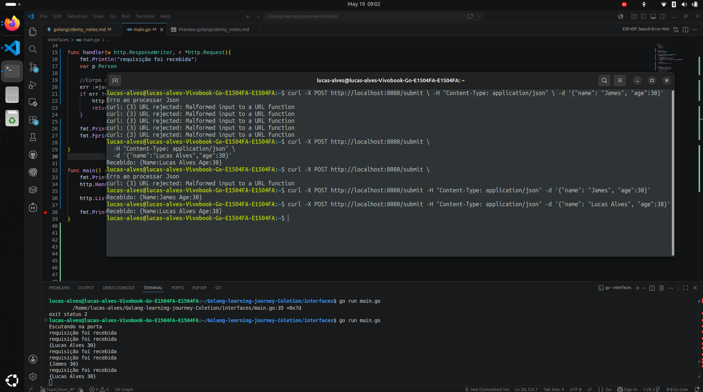

# 🎯 Operações em arquivos  

```go
 Conceito	               O que é	                        Por que é importante  
 defer file.Close()	       Fecha arquivo automaticamente	EVITA VAZAMENTO DE MEMÓRIA  
os.Open()	               Abre arquivo para leitura	    Retorna *File e error
bufio.Scanner	           Lê linha por linha	            Eficiente para arquivos grandes
os.ReadFile()	           Lê arquivo inteiro de uma vez	Simples para arquivos pequenos 


``` 

**Verificar erros	Sempre if err != nil OBRIGATÓRIO em Go**

# 📂 Estrutura de Arquivo para Testes  
**Crie um arquivo dados.txt para testar:**

```go
linha 1: Hello World
linha 2: Go é incrível
linha 3: Aprendendo arquivos
linha 4: Última linha
```

## 1. 📖 Método 1: os.ReadFile() - Ler arquivo INTEIRO  

- Quando usar: Arquivos PEQUENOS (< 10MB) que cabem em memória 

```go
package main

import (
    "fmt"
    "os"
)

func main() {
    // 1. Lê o arquivo inteiro de uma vez
    dados, err := os.ReadFile("dados.txt")
    if err != nil {
        fmt.Println("Erro ao ler arquivo:", err)
        return
    }
    
    // 2. Converte para string e exibe
    fmt.Println(string(dados))
}
```
Vantagens: ✅ Simples,
✅ Uma linha
✅ Fecha automaticamente  
**Desvantagens:** ❌ Carrega tudo na memória, ❌ Ruim para arquivos gigantes

---
# 2. 📖 Método 2: os.Open() + defer - Abrir e LER COM SEGURANÇA  

**Quando usar: PRÁTICA RECOMENDADA para a maioria dos casos**  

```go 

package main

import (
    "bufio"
    "fmt"
    "os"
)

func main() {
    // 1. Abrir o arquivo
    file, err := os.Open("dados.txt")
    if err != nil {
        fmt.Println("Erro ao abrir arquivo:", err)
        return
    }
    defer file.Close()  // ← ESSENCIAL! Fecha automaticamente no final
    
    // 2. Criar scanner para ler linha por linha
    scanner := bufio.NewScanner(file)
    
    // 3. Ler cada linha
    for scanner.Scan() {
        linha := scanner.Text()
        fmt.Println(linha)
    }
    
    // 4. Verificar se houve erro na leitura
    if err := scanner.Err(); err != nil {
        fmt.Println("Erro ao ler arquivo:", err)
    }
}

```

**Quando usar: PRÁTICA RECOMENDADA para a maioria dos casos**

---
# 🔧 BOAS PRÁTICAS Essenciais  
- 1. SEMPRE use defer file.Close()! 
- 2. SEMPRE verifique erros! 
- 3. Use defer LOGO APÓS abrir o arquivo 
- 4. Propague erros com contexto 
  
## 📊 Comparação dos Métodos   


```go

Método	            Quando usar	                            Vantagem	                     Desvantagem
os.ReadFile()	    Arquivos pequenos (<10MB)	            ✅ Mais simples	                ❌ Carrega tudo na memória
bufio.Scanner	    Arquivos grandes, linha a linha	        ✅ Memória eficiente	            ❌ Linha >64KB quebra
bufio.Reader	    Processamento em chunks	                ✅ Controle granular	            ❌ Mais código
os.OpenFile()	    Precisa de controle de flags	        ✅ Flexível	                    ❌ Mais complexo

``` 
# 📡 Servidor HTTP com Decodificação JSON - Exemplo Didático

## 🎯 O que este código faz

Um servidor HTTP minimalista que:
- Escuta na porta `8080`
- Recebe requisições POST no endpoint `/submit`
- Decodifica JSON para uma struct Go
- Exibe os dados no console
- Retorna os dados recebidos como resposta

---

## 📝 Código Completo

```go
package main

import (
    "encoding/json"
    "fmt"
    "net/http"
)

// Person representa a estrutura de dados esperada no JSON
type Person struct {
    Name string `json:"name"`  // ← Mapeia "name" do JSON para Name
    Age  int    `json:"age"`   // ← Mapeia "age" do JSON para Age
}

// handler processa as requisições HTTP
func handler(w http.ResponseWriter, r *http.Request) {
    fmt.Println("requisição foi recebida")
    
    var p Person
    
    // Decodifica o JSON do corpo da requisição para a struct
    err := json.NewDecoder(r.Body).Decode(&p)
    if err != nil {
        http.Error(w, "Erro ao processar Json", http.StatusBadRequest)
        return
    }
    
    // Exibe a struct no console do servidor
    fmt.Println(p)
    
    // Envia a struct de volta como resposta
    fmt.Fprintf(w, "Recebido: %+v\n", p)
}

func main() {
    fmt.Println("Escutando na porta 8080")
    
    // Registra a função handler para o endpoint /submit
    http.HandleFunc("/submit", handler)
    
    // Inicia o servidor (esta linha bloqueia a execução)
    http.ListenAndServe(":8080", nil)
    
    // Esta linha só executa se o servidor parar
    fmt.Println("...FIM...")
}


🔍 Explicação Linha por Linha
1. A Struct Person
go

type Person struct {
    Name string `json:"name"`
    Age  int    `json:"age"`
}

    Define como os dados JSON serão armazenados em memória

    As tags json:"..." mapeiam os campos do JSON para os campos da struct

2. O Handler
go

func handler(w http.ResponseWriter, r *http.Request) {

    w: Usado para escrever a resposta

    r: Contém os dados da requisição (incluindo o corpo)

3. Decodificação do JSON
go

var p Person
err := json.NewDecoder(r.Body).Decode(&p)

    r.Body: Corpo da requisição (onde o JSON está)

    json.NewDecoder(): Cria um decodificador JSON

    .Decode(&p): Converte JSON para struct e armazena em p

    O & (ponteiro) é necessário para modificar a struct

4. Tratamento de Erro
go

if err != nil {
    http.Error(w, "Erro ao processar Json", http.StatusBadRequest)
    return
}

    Se o JSON for inválido, retorna erro 400 Bad Request

    O servidor não quebra, apenas responde com erro

5. Resposta ao Cliente
go

fmt.Println(p)                     // Log no console do servidor
fmt.Fprintf(w, "Recebido: %+v\n", p)  // Resposta para o cliente

    fmt.Fprintf(w, ...) escreve diretamente na resposta HTTP

    %+v exibe os nomes dos campos junto com os valores

6. O Servidor
go

http.HandleFunc("/submit", handler)    // Registra a rota
http.ListenAndServe(":8080", nil)      // Inicia o servidor

    HandleFunc: Diz ao Go: "quando chegar requisição em /submit, chame handler"

    ListenAndServe: Inicia o servidor na porta 8080

🧪 Como Testar
1. Inicie o servidor
bash

go run main.go

Saída esperada:
text

Escutando na porta 8080

2. Envie uma requisição (em outro terminal)

Usando curl:
bash

curl -X POST http://localhost:8080/submit \
  -H "Content-Type: application/json" \
  -d '{"name":"Lucas Alves","age":30}'

Saída esperada:
text

Recebido: {Name:Lucas Alves Age:30}
```

